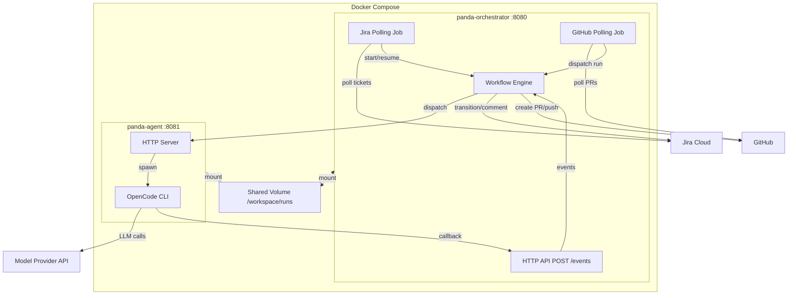
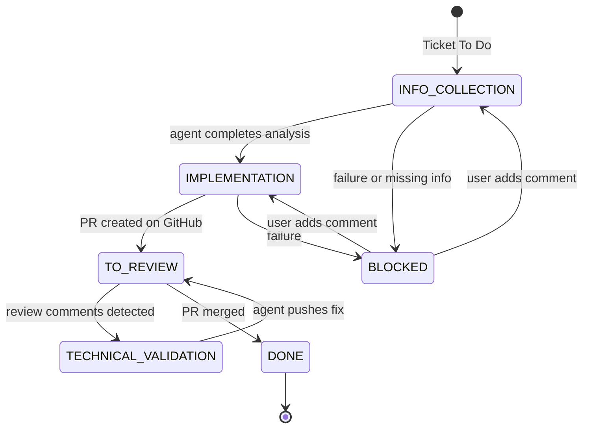
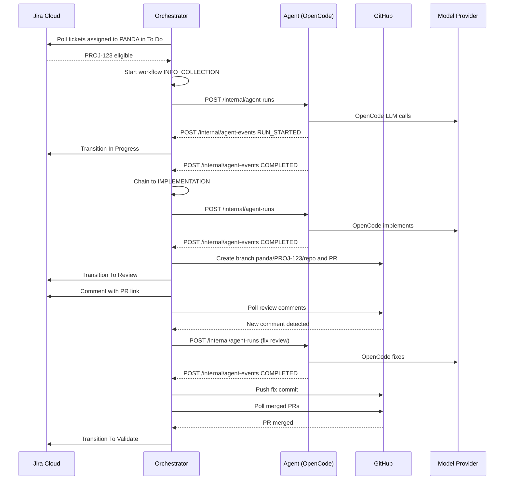
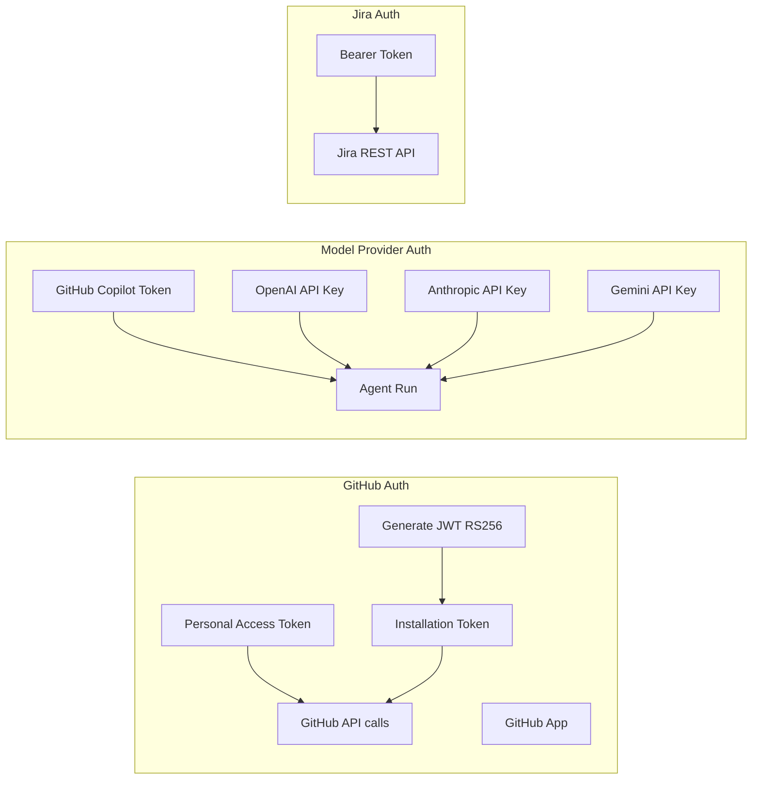
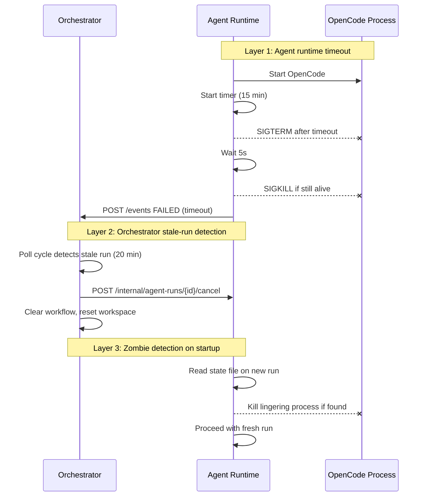

# Architecture Diagrams

## System Architecture

```mermaid
graph TB
    subgraph Docker[Docker Compose]
        subgraph Orchestrator[panda-orchestrator :8080]
            JiraPoll[Jira Polling Job]
            GitHubPoll[GitHub Polling Job]
            Workflow[Workflow Engine]
            API[HTTP API POST /events]
        end

        subgraph Agent[panda-agent :8081]
            AgentHTTP[HTTP Server]
            OpenCode[OpenCode CLI]
        end

        Volume["Shared Volume /workspace/runs"]
    end

    Jira[Jira Cloud]
    GitHub[GitHub]
    ModelProvider[Model Provider API]

    JiraPoll -->|poll tickets| Jira
    JiraPoll -->|start/resume| Workflow
    GitHubPoll -->|poll PRs| GitHub
    GitHubPoll -->|dispatch run| Workflow
    Workflow -->|dispatch| AgentHTTP
    API -->|events| Workflow
    Workflow -->|transition/comment| Jira
    Workflow -->|create PR/push| GitHub

    AgentHTTP -->|spawn| OpenCode
    OpenCode -->|LLM calls| ModelProvider
    OpenCode -->|callback| API

    Orchestrator <-->|mount| Volume
    Agent <-->|mount| Volume
```

## Workflow State Machine

```mermaid
stateDiagram-v2
    [*] --> INFO_COLLECTION : Ticket To Do

    INFO_COLLECTION --> IMPLEMENTATION : agent completes analysis
    IMPLEMENTATION --> TO_REVIEW : PR created on GitHub

    TO_REVIEW --> TECHNICAL_VALIDATION : review comments detected
    TECHNICAL_VALIDATION --> TO_REVIEW : agent pushes fix

    TO_REVIEW --> DONE : PR merged

    INFO_COLLECTION --> BLOCKED : failure or missing info
    IMPLEMENTATION --> BLOCKED : failure
    BLOCKED --> INFO_COLLECTION : user adds comment
    BLOCKED --> IMPLEMENTATION : user adds comment

    DONE --> [*]
```

## End-to-End Sequence

```mermaid
sequenceDiagram
    participant J as Jira Cloud
    participant O as Orchestrator
    participant A as Agent (OpenCode)
    participant GH as GitHub
    participant M as Model Provider

    O->>J: Poll tickets assigned to PANDA in To Do
    J-->>O: PROJ-123 eligible

    O->>O: Start workflow INFO_COLLECTION
    O->>A: POST /internal/agent-runs

    A->>M: OpenCode LLM calls
    A-->>O: POST /internal/agent-events RUN_STARTED
    O->>J: Transition In Progress

    A-->>O: POST /internal/agent-events COMPLETED
    O->>O: Chain to IMPLEMENTATION
    O->>A: POST /internal/agent-runs

    A->>M: OpenCode implements
    A-->>O: POST /internal/agent-events COMPLETED

    O->>GH: Create branch panda/PROJ-123/repo and PR
    O->>J: Transition To Review
    O->>J: Comment with PR link

    O->>GH: Poll review comments
    GH-->>O: New comment detected

    O->>A: POST /internal/agent-runs (fix review)
    A->>M: OpenCode fixes
    A-->>O: POST /internal/agent-events COMPLETED
    O->>GH: Push fix commit

    O->>GH: Poll merged PRs
    GH-->>O: PR merged
    O->>J: Transition To Validate
```

## Authentication Flows

```mermaid
graph LR
    subgraph GitHubAuth[GitHub Auth]
        direction TB
        PAT[Personal Access Token]
        AppAuth[GitHub App]
        JWT[Generate JWT RS256] --> InstToken[Installation Token]
        PAT --> GitAPI[GitHub API calls]
        InstToken --> GitAPI
    end

    subgraph ModelAuth[Model Provider Auth]
        direction TB
        Copilot[GitHub Copilot Token]
        OpenAI[OpenAI API Key]
        Anthropic[Anthropic API Key]
        Gemini[Gemini API Key]
        Copilot --> AgentRun[Agent Run]
        OpenAI --> AgentRun
        Anthropic --> AgentRun
        Gemini --> AgentRun
    end

    subgraph JiraAuth[Jira Auth]
        Bearer[Bearer Token] --> JiraAPI[Jira REST API]
    end
```

## Timeout and Recovery

```mermaid
sequenceDiagram
    participant O as Orchestrator
    participant A as Agent Runtime
    participant P as OpenCode Process

    Note over A,P: Layer 1: Agent runtime timeout
    A->>P: Start OpenCode
    A->>A: Start timer (15 min)
    A--xP: SIGTERM after timeout
    A->>A: Wait 5s
    A--xP: SIGKILL if still alive
    A->>O: POST /events FAILED (timeout)

    Note over O,A: Layer 2: Orchestrator stale-run detection
    O->>O: Poll cycle detects stale run (20 min)
    O->>A: POST /internal/agent-runs/{id}/cancel
    O->>O: Clear workflow, reset workspace

    Note over O,A: Layer 3: Zombie detection on startup
    A->>A: Read state file on new run
    A--xP: Kill lingering process if found
    A->>A: Proceed with fresh run
```
