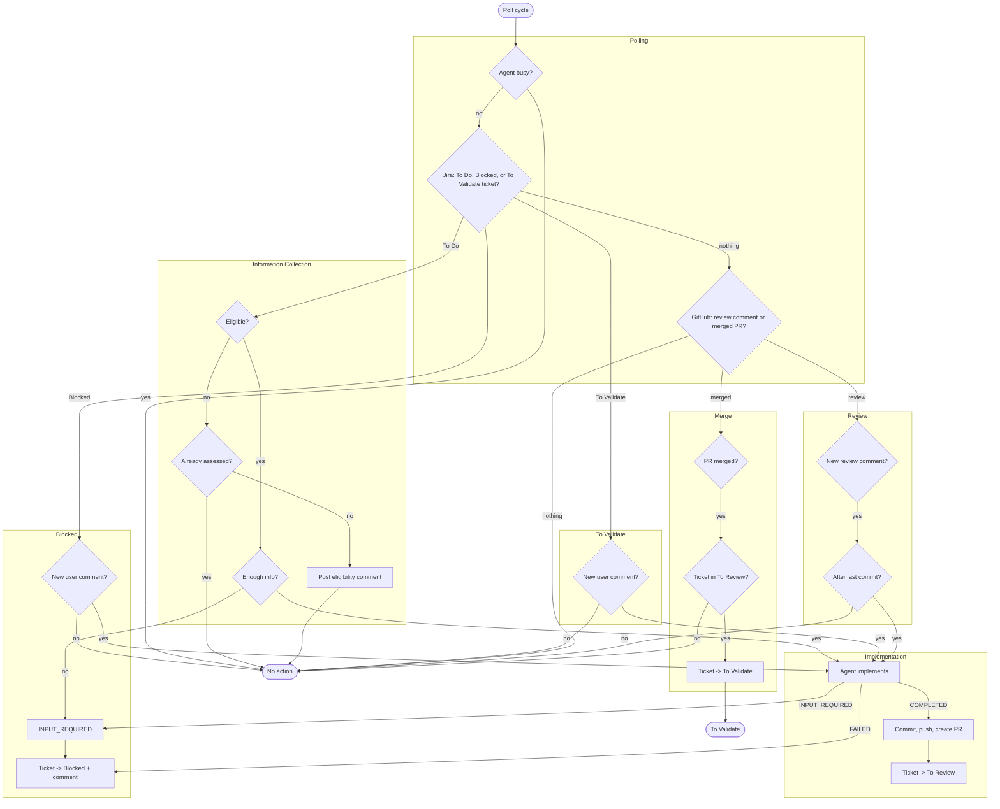

# Workflow

End-to-end workflow for the DevFlow orchestrator.

## Flow summary

1. Every eligible ticket starts with an `INFORMATION_COLLECTION` agent run — the agent explores the codebase, validates its understanding, and detects ambiguities.
2. If the agent needs clarification, it calls `devflow_request_input` and the ticket is blocked with a Jira comment.
3. If the agent has enough context, it calls `devflow_complete_run` and the orchestrator chains directly to an `IMPLEMENTATION` run.
4. After implementation, the orchestrator commits, pushes, and creates PRs. The ticket moves to "To Review".
5. Review comments on PRs trigger new agent runs to address feedback.
6. Once all PRs are merged, the ticket moves to "To Validate".
7. A new Jira comment on a ticket in "To Validate" triggers a fresh implementation run.

## Diagram

## Jira status transitions

| From | To | Trigger |
|------|----|---------|
| To Do | In Progress | Agent run starts (`RUN_STARTED`) |
| In Progress | To Review | Implementation completed, PRs created |
| In Progress | Blocked | Agent needs input or fails |
| Blocked | In Progress | New user comment triggers a new agent run |
| To Review | In Progress | Review comment triggers a fix run |
| To Review | To Validate | All PRs merged |
| To Validate | In Progress | New ticket comment triggers a new implementation run |

## Phase chaining

When `INFORMATION_COLLECTION` completes, the orchestrator chains directly to `IMPLEMENTATION`:

1. `AgentEventService` receives `COMPLETED` for info collection
2. `DevFlowRuntime.replacePhase(IMPLEMENTATION, newAgentRunId)` updates the volatile reference
3. A new agent run is dispatched asynchronously with a 3-second delay (to avoid deadlock on the callback thread)
4. The agent starts implementing on the same workspace
