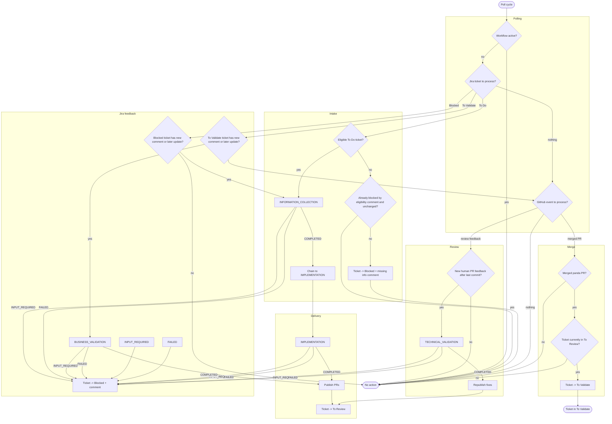

# Workflow

End-to-end workflow for the current PANDA implementation.

## Flow summary

1. Eligible tickets in "To Do" start with an `INFORMATION_COLLECTION` run.
2. Ineligible tickets are moved to "Blocked" with a Jira comment that lists the missing information.
3. `INFORMATION_COLLECTION` either requests clarification or chains automatically into `IMPLEMENTATION`.
4. `IMPLEMENTATION` publishes code changes and moves the ticket to "To Review".
5. New human feedback on an open PANDA pull request triggers `TECHNICAL_VALIDATION` on the reviewed branch.
6. Merged PANDA pull requests move the ticket to "To Validate".
7. New Jira feedback on a ticket in "To Validate" triggers `BUSINESS_VALIDATION`.
8. Blocked and validation tickets can resume from either a new Jira comment or a later ticket update after the last PANDA comment.

## Diagram

## Jira status transitions

| From | To | Trigger |
|------|----|---------|
| To Do | In Progress | Eligible ticket starts an agent run (`RUN_STARTED`) |
| To Do | Blocked | Ticket is ineligible and PANDA posts the missing-info comment |
| Blocked | In Progress | Jira feedback resumes `INFORMATION_COLLECTION` |
| In Progress | Blocked | Agent requests input, fails, or publication fails |
| In Progress | To Review | `IMPLEMENTATION`, `TECHNICAL_VALIDATION`, or `BUSINESS_VALIDATION` publishes changes successfully |
| To Review | In Progress | GitHub review feedback starts `TECHNICAL_VALIDATION` |
| To Review | To Validate | A PANDA pull request merge is detected |
| To Validate | In Progress | Jira feedback starts `BUSINESS_VALIDATION` |

## Phase chaining

When `INFORMATION_COLLECTION` completes, the orchestrator chains directly to `IMPLEMENTATION`:

1. `HandleAgentEventUseCase` receives `COMPLETED` for the current `INFORMATION_COLLECTION` run.
2. `InMemoryWorkflowHolder.replacePhase(IMPLEMENTATION, newAgentRunId)` swaps the active phase while keeping the same workflow ID.
3. A new agent run is dispatched asynchronously after a 3-second delay.
4. The implementation run starts on the same shared workspace.
