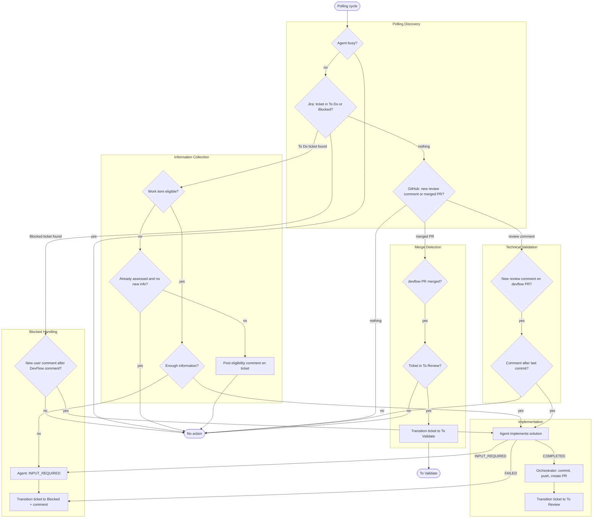

# Devflow Workflow

Canonical end-to-end workflow for the orchestrator.

Dans l'implementation actuelle (v0 stateless):

- tout nouveau ticket eligible passe d'abord par un run agent `INFORMATION_COLLECTION`
- ce run ne code pas encore: il valide la comprehension, detecte les ambiguites
- il emet soit `INPUT_REQUIRED` (ticket bloque), soit `COMPLETED` (chaine vers `IMPLEMENTATION`)
- l'orchestrateur est stateless: pas de base de donnees, un seul `volatile currentRun`
- l'intake est polling-only depuis Jira et GitHub

