# Devflow Workflow

Canonical end-to-end workflow for the orchestrator.

Dans l'implementation actuelle, tout nouveau ticket eligible passe d'abord par un run agent `INFORMATION_COLLECTION`.
Ce run ne code pas encore: il valide la comprehension, detecte les ambiguites et emet soit `INPUT_REQUIRED`, soit `COMPLETED`, ce qui declenche ensuite la phase `IMPLEMENTATION`.

```mermaid
flowchart TD
    start([Workflow signal received])
    ignored([No action])
    done([Done])

    subgraph info["Information Collection"]
        eligible{Work item eligible?}
        enoughInfo{Enough information to start?}
        envAvailable{Execution environment available?}
        waitInfo[[Blocked: waiting for missing information]]
        waitEnv[[Blocked: waiting for execution environment]]
    end

    subgraph impl["Implementation"]
        prepareWorkspace[Provision workspace]
        pullRepos[Pull repositories]
        createBranch[Create or reuse branch]
        implement[Implement solution]
        localChecks[Run local checks]
        publishChanges[Push changes]
        openOrUpdateChange[Create or update code change]
        notifyDev[Comment work item and move it to technical review]
        waitTech[[Waiting for technical review]]
    end

    subgraph tech["Technical Validation"]
        reviewComment{New technical review comment?}
        canResolveTech{Enough information to resolve the technical comment?}
        waitTechInfo[[Blocked: waiting for technical clarification]]
        merged{Code change merged?}
        waitMerge[[Waiting for merge or further review]]
    end

    subgraph biz["Business Validation"]
        notifyBiz[Comment work item and move it to business validation]
        waitBiz[[Waiting for business validation]]
        validated{Business validated?}
        bizComment{New business comment?}
        canResolveBiz{Enough information to resolve the business comment?}
        waitBizInfo[[Blocked: waiting for business clarification]]
    end

    start --> signal{Signal type?}

    signal -- New work item --> eligible
    signal -- Comment on blocked work item --> enoughInfo
    signal -- Execution environment available --> envAvailable
    signal -- Technical review event --> reviewComment
    signal -- Code change merged --> merged
    signal -- Business validation status --> validated
    signal -- Business comment --> bizComment

    eligible -- no --> ignored
    eligible -- yes --> enoughInfo

    enoughInfo -- no --> waitInfo
    enoughInfo -- yes --> envAvailable

    waitInfo -. new ticket comment .-> enoughInfo

    envAvailable -- no --> waitEnv
    envAvailable -- yes --> prepareWorkspace

    waitEnv -. environment available .-> prepareWorkspace

    prepareWorkspace --> pullRepos --> createBranch --> implement --> localChecks --> publishChanges --> openOrUpdateChange --> notifyDev --> waitTech

    waitTech -. review comment .-> reviewComment
    waitTech -. merge event .-> merged

    reviewComment -- no --> waitMerge
    reviewComment -- yes --> canResolveTech

    canResolveTech -- no --> waitTechInfo
    canResolveTech -- yes --> prepareWorkspace

    waitTechInfo -. new PR/MR comment or updated ticket .-> canResolveTech

    merged -- no --> waitMerge
    merged -- yes --> notifyBiz

    waitMerge -. review comment .-> reviewComment
    waitMerge -. merge event .-> merged

    notifyBiz --> waitBiz

    waitBiz -. validation result .-> validated
    waitBiz -. business comment .-> bizComment

    validated -- yes --> done
    validated -- no --> bizComment

    bizComment -- no --> waitBiz
    bizComment -- yes --> canResolveBiz

    canResolveBiz -- no --> waitBizInfo
    canResolveBiz -- yes --> prepareWorkspace

    waitBizInfo -. new business comment .-> canResolveBiz
```

